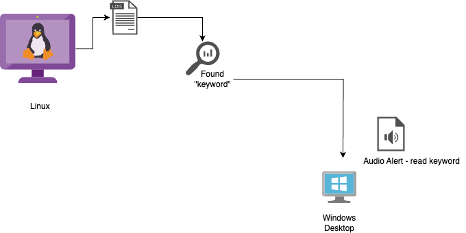

# LogCast
A simple Python socket server and client application to monitor a log file on a remote linux server for specific keywords and send audio alerts to a Windows client. 

# How it works

server.py monitors file changes and, when it finds the specified keyword in a continuously writing file, it broadcasts a message to connected socket clients.
The Windows client uses win11toast for visual notifications and pyttsx for audio notifications.

# Need help ?

- Write your comments and issues in issues section of this repository . Or you can mail at balusreekanthATgmailDOTcom

# Would you like to improve this ?
- I Love to  see pull requests to improve this script further . 
